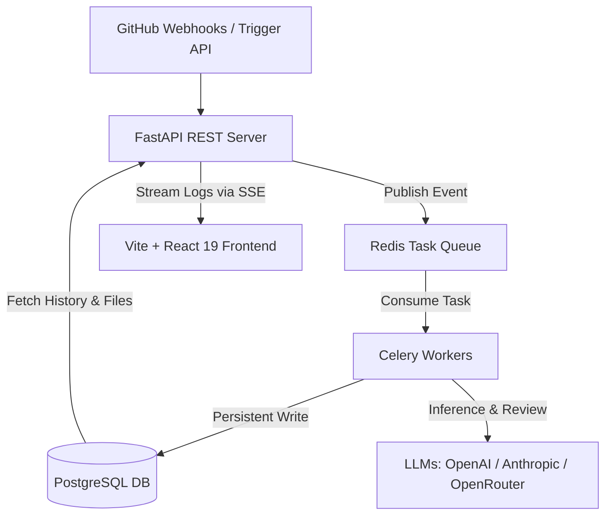

# 🤖 Agentic Code Review Portal

An intelligent, real-time code analysis and automated review dashboard powered by FastAPI, Celery, Redis, PostgreSQL, React 19, and advanced LLMs. 

This platform connects seamlessly to GitHub as an App to automatically ingest pull requests, analyze codebase alterations, map and visualize line-by-line diffs, and stream the step-by-step "chain of thought" thinking logs of agentic code-reviewers in real time.

---

## 🏗️ Architectural Blueprint

The platform is designed around a decoupled, highly concurrent architecture that combines fast REST proxying, background celery tasks, and a reactive glassmorphic frontend UI.



### 1. The Backend Core (`/backend`)
* **FastAPI**: Serves high-performance, asynchronous REST endpoints for repositories, pull requests, reviews, and event stream pipelines.
* **SQLAlchemy Asyncio & Alembic**: Fully asynchronous database session management with Postgres using raw `asyncpg`. Handles schema migrations and relational tables dynamically.
* **Redis & Celery**: Powers the background task orchestration. Reviews run as background workers so long-running LLM completions never block the primary HTTP API.
* **Server-Sent Events (SSE)**: Streams step-by-step progress and live thinking logs from active reviews to the client using a non-blocking asyncio stream protocol.

### 2. The Frontend Core (`/frontend`)
* **Vite + React 19**: Extreme-speed build engine coupled with React 19's virtual DOM structure.
* **TypeScript & Zustand**: Robust type checking paired with a centralized state store management system, handling repository metadata, open pull requests, and review streaming reactively.
* **TailwindCSS v4**: Next-generation utility-first styling powering flat-glassmorphic styling, high-contrast dark themes, custom scrollbars, and glowing selection highlights.

---

## ✨ Feature Showcases

### 🔍 1. Interactive PR Diff Checker (New)
The newly introduced **Diff** checker tab offers a visualizer for investigating pull request files and line-by-line differences:
* **Dropdown Switcher**: Instantly switch between any open pull requests in the selected repository.
* **File Metadata Sidebar**: Displays a list of altered files containing custom badges for their status (`added`, `removed`, `modified`, `renamed`) alongside color-coded indicators of the lines changed (e.g. `+14 -3`).
* **Custom Unified Code Diff Viewer**: A highly lightweight React diff visualizer. Colorizes:
  * **Additions**: Styled in bright emerald with background and border green hues (`bg-emerald/5 border-emerald`).
  * **Deletions**: Highlighted in dark rose with corresponding border structures (`bg-rose/5 border-rose`).
  * **Metadata Blocks (`@@`)**: Displayed with deep purple border elements to represent index ranges elegantly.
  * **Renamed/Binary Fallbacks**: Automatically renders descriptive panels for renamed-only files, empty files, or binary content.

### 🧠 2. Real-Time Agent "Chain-of-Thought" Stream
Review agents are completely transparent. As the Celery worker triggers and coordinates the review process, it publishes sequential steps to the database:
* **Live SSE Loading**: Active reviews establish a Server-Sent Events (SSE) tunnel, loading thinking steps, analysis highlights, and logs progressively on the user screen.
* **Static Fallback Loader**: Terminal reviews (`completed` or `failed`) instantly pull raw JSON records from the Postgres database without starting background network connections.
* **Dual-Level Exception Propagation**: If the worker runs into a database connection issue, network timeout, or configuration bug, the system automatically catches the exception, updates the review state to `failed`, and streams the formatted error traceback directly into the detail card to avoid hung loading states.

### 📝 3. Custom Recursive Markdown Renderer
To support beautiful tables, listings, and analysis feedback from the AI models:
* Avoids standard React 19 markdown package incompatibilities by using a custom, high-speed, native tokenizing React renderer.
* Parses and renders **Markdown Tables** with custom column alignments (`left`, `center`, `right`) and zebra-striped border highlights.
* Handles deep recursive blockquotes, bulleted and numbered list groups, horizontal rules, and inline bold, italic, links, and code segments smoothly.

---

## 🚀 How to Run the Project

### 📋 Prerequisites
Ensure you have the following installed on your local development machine:
1. **Docker & Docker Compose**
2. **Node.js (v18+)** *(Optional - only required if running frontend outside Docker)*

---

### ⚙️ Environment Configuration

1. Create a `.env` file in the **`backend/`** directory. You can copy the template from `backend/.env.example`:
   ```bash
   cp backend/.env.example backend/.env
   ```

2. Fill in the required variables inside `backend/.env`:
   * **PostgreSQL & Redis**: Set database credentials and connection strings (defaults are preconfigured to match the Docker services).
   * **AI Provider Keys**: Define `OPENAI_API_KEY`, `ANTHROPIC_API_KEY`, or `OPENROUTER_API_KEY` to enable the review agents.
   * **GitHub Integration**:
     * Create a **GitHub App** on your profile/organization.
     * Generate and paste the `GITHUB_APP_ID`, `GITHUB_CLIENT_ID`, `GITHUB_CLIENT_SECRET`, and `GITHUB_PRIVATE_KEY` (as a single-line string with newlines represented by `\n`).
     * Set the redirect URL to `http://localhost:5173/auth/callback` to support user logins.

---

### 🐳 Starting the Stack (Docker Compose)

The easiest way to boot up the entire backend ecosystem (API, Database, Redis, Celery Workers, and Celery Beat) is via Docker Compose:

1. **Build and start the containers** (from the project root):
   ```bash
   docker compose up --build -d
   ```

2. **Verify that all services are active**:
   ```bash
   docker compose ps
   ```
   * *Expected output:* `backend-api-1` running on port `8000`, `backend-db-1` on port `5432`, and the celery workers/beat active.

3. **Apply Database Migrations**:
   Run Alembic inside the running API container to build your database tables:
   ```bash
   docker compose exec api alembic upgrade head
   ```

---

### 💻 Starting the Frontend (Vite)

To start the frontend client locally for development:

1. **Navigate to the frontend directory**:
   ```bash
   cd frontend
   ```

2. **Install dependencies**:
   ```bash
   npm install
   ```

3. **Run the Vite development server**:
   ```bash
   npm run dev
   ```
   * The web application will launch at **`http://localhost:5173`**.

4. **Verify Compilation and Typings**:
   Verify that your TypeScript build compiles with zero warnings:
   ```bash
   npm run build
   ```
   To run the linter and ensure formatting checks pass:
   ```bash
   npm run lint
   ```

---

## 🛠️ Developer Verification & Commands

* **Rebuilding backend worker**: If you update prompt rules or task schemas, restart the worker container:
  ```bash
  docker compose restart worker
  ```
* **Inspecting Celery Logs**:
  ```bash
  docker compose logs -f worker
  ```
* **API Documentation**: The interactive OpenAPI specification is available at **`http://localhost:8000/docs`** when the API container is running.
